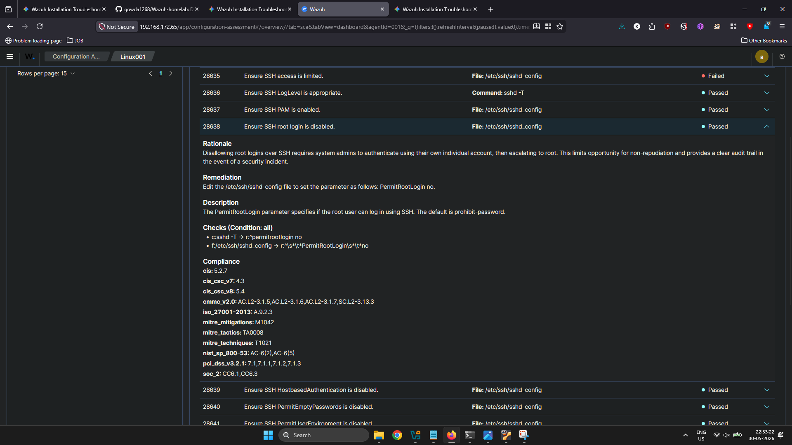

# Enterprise Multi-OS Wazuh SIEM Lab: Automated Active Response & Privilege Escalation Auditing

## 📌 Project Overview
This project documents the end-to-end engineering, deployment, and optimization of an enterprise-grade Wazuh SIEM/XDR telemetry pipeline across a distributed network. The laboratory environment features a central Wazuh Manager orchestration node built on Ubuntu Server, capturing and analyzing endpoint security data from a dedicated Ubuntu Server Agent node. 

The entire detection array was managed, monitored, and stress-tested using a physical Windows 11 host system acting as both the primary administrative Control Center and the external network attacker profile.

Beyond basic installation, this case study details advanced infrastructure troubleshooting—specifically resolving critical Java-backend storage watermark blocks via live Linux Logical Volume Manager (LVM) partition scaling. Finally, the pipeline was validated by engineering a real-time automated Active Response firewall block against automated network attacks and tracking high-severity insider threat privilege escalation attempts.

---

## 🛠️ Core Skills & Technologies Demonstrated
* **SIEM/XDR Architecture:** Distributed deployment of Wazuh Manager, Wazuh Indexer core database, and Wazuh Dashboard analytics.
* **SOAR & Active Response Automation:** Configuring automatic host containment parameters via `iptables` rulesets pushed dynamically from the manager core.
* **Linux Systems Engineering:** Live LVM partition extensions, advanced Systemd service debugging, process tracking, and storage ceiling mitigation.
* **Endpoint Detection Engineering:** Auditing high-frequency SSH authentication brute-force vectors, internal shell command analysis (`journald` parsing), and MITRE ATT&CK framework mapping.

---

## 🏗️ Lab Architecture & Network Topology
The environment utilizes a routeable Bridged Network topology to ensure transparent network packet delivery and accurate host source-IP tracking across the logging pipeline.
```text

       ## 🏗️ Lab Architecture & Network Topology

The infrastructure is deployed within an isolated virtual network environment, utilizing a dedicated host-only adapter network to facilitate secure, out-of-band telemetry aggregation and threat simulation.


               +----------------------------------------+
               |          SIEM Management Node          |
               |                                        |
               |  OS: Ubuntu Server (Linux Manager)     |
               |  IP Address: 192.168.120.65            |
               +-------------------+--------------------+
                                   |
                                   | [Port 1514/1515: Encrypted Agent Telemetry]
                                   |
         +-------------------------+-------------------------+
         |                                                   |
         v                                                   v
+--------+-----------------------+                  +---------+---------------------+
|        Target Host 01          |                  |        Target Host 02         |
|                                |                  |                               |
| OS: Ubuntu Desktop (Linux)     |                  | OS: Windows 11 Enterprise     |
| Agent ID: 001                  |                  | Agent ID: 002                 |
| Role: Attack Surface Endpoint  |                  | Role: Attack Surface Endpoint |
+--------------------------------+                  +-------------------------------+


# 🪟 Phase 2: Windows Endpoint Monitoring & Compliance Hardening (Agent 002

🚀 Phase 1: Distributed Installation Lifecycle
1. Central Manager Provisioning

The central orchestration node was stood up on an Ubuntu Server environment using the automated enterprise installation architecture pipeline:

curl -sO [https://packages.wazuh.com/4.x/wazuh-install.sh](https://packages.wazuh.com/4.x/wazuh-install.sh) && sudo bash wazuh-install.sh -a

#### 🌐 Wazuh Web Interface Overview


2. Linux Endpoint Enrollment (Linux001)

The separate Ubuntu Server endpoint agent was configured to securely register and bind its telemetry stream to the manager's listening socket:
# Download and install the official Wazuh repository GPG key
wget -qO - [https://packages.wazuh.com/key/GPG-KEY-WAZUH](https://packages.wazuh.com/key/GPG-KEY-WAZUH) | gpg --dearmor -o /usr/share/keyrings/wazuh.gpg

# Add the repository list entry
echo "deb [signed-by=/usr/share/keyrings/wazuh.gpg] [https://packages.wazuh.com/4.x/apt/](https://packages.wazuh.com/4.x/apt/) stable main" | sudo tee /etc/apt/sources.list.d/wazuh.list

# Update package lists and install the agent pointed to the Manager IP
sudo apt-get update && WAZUH_MANAGER='192.168.172.65' sudo apt-get install wazuh-agent

# Enable and start the background daemon service
sudo systemctl daemon-reload
sudo systemctl enable wazuh-agent
sudo systemctl start wazuh-agent


#### 📊 Agent Deployment Verification


🛑 Phase 2: Infrastructure Engineering & Storage Resolution
1. Diagnosing Storage Watermark Freezes (OSError: [Errno 28])

During infrastructure initialization, the wazuh-manager.service failed to start. Forcing the background process into the foreground (sudo /var/ossec/bin/wazuh-apid -f) revealed a fatal exception: OSError: [Errno 28] No space left on device.

Running df -h confirmed that the root logical volume was pinned at 100% capacity. This storage ceiling hit the Wazuh Indexer's (OpenSearch) protective Flood-Stage Disk Watermark (95%), locking down all database write operations and triggering infinite boot loops.
2. Live LVM Volume Expansion

To resolve this issue gracefully without data loss or service degradation, Linux Logical Volume Manager (LVM) utilities were leveraged to dynamically allocate virtual hardware storage on-the-fly without requiring a system restart:


# Evaluate available physical group boundaries to confirm unallocated sector space
sudo vgs

# Extend the underlying logical file allocation to absorb 100% of newly exposed space
sudo lvextend -l +100%FREE -r /dev/mapper/ubuntu--vg-ubuntu--lv


⚡ Phase 3: Detection Engineering & Security Scenarios

# 🪟 Phase 1 : Linux  Endpoint Monitoring 


Scenario 1: Automated SSH Brute-Force & Active Response Containment

An aggressive SSH brute-force simulation loop was launched from the Windows Host machine terminal targeting the Ubuntu Linux Agent node:

# Executed from Windows Host PowerShell (192.168.172.146)
for ($i=1; $i -le 10; $i++) { ssh fakeuser@192.168.172.11 }

🛠️ Active Response Rule Optimization

To prevent service crashes, /var/ossec/etc/ossec.conf on the Wazuh Manager was optimized to handle local containment blocks dynamically:

<active-response>
  <command>firewall-drop</command>
  <location>local</location>
  <level>5</level>
</active-response>


The pipeline successfully identified the high-frequency failure pattern originating from the Windows host and automatically dropped the attacking connections. Running iptables -L INPUT -v -n on the agent verified live firewall bans dropping traffic from 192.168.172.146.

📊 Ingestion & Detection Verification

The screenshot below displays the Wazuh Dashboard capturing the transition from individual low-severity authentication warnings to an aggregated, high-severity Level 10 alert. This demonstrates Wazuh's correlation engine recognizing the rapid-fire nature of the network brute-force attack originating from the Windows host.

#### 📊 Attack & Containment Artifacts


Scenario 2: Host Privilege Escalation (Sudo Abuse)

To validate internal insider-threat tracking capabilities, an intentional privilege escalation attempt was simulated directly on the agent terminal by purposefully forcing high-severity administrative authorization failures via the sudo boundary:

sudo -k && sudo ls /root
# (Deliberately inputted incorrect credentials 3 consecutive times)

📊 Administrative Log Audit

The screenshot below shows the raw telemetry ingested from the agent's system logs. Wazuh successfully parsed the failed administrative tracking event, highlighted the precise user account (x2) executing the command, raised it to a Level 10 alert severity, and accurately mapped the event behavior to MITRE ATT&CK Technique T1548.003.


#### 📊 Privilege Escalation Artifacts


Scenario 3: Local Account Tampering (File Integrity Monitoring)

To verify real-time monitoring of critical files, real-time tracking attributes were appended to the <syscheck> section inside the agent's ossec.conf:


<directories realtime="yes" report_changes="yes">/etc</directories>
An adversary simulation was executed on the agent by forcing an unauthorized local account creation:
sudo useradd hacker_test

📊 FIM Real-Time Alert Analytics

The screenshot below captures the real-time File Integrity Monitoring dashboard the moment the unauthorized local user account was created. It maps out the exact timestamps and highlights modifications made directly to the core security files (/etc/passwd and /etc/shadow).


#### 📊 File Integrity Monitoring (FIM) Evidence


Scenario 4: Continuous Vulnerability Assessment & System Hardening

To identify software weaknesses, the Vulnerability Detector was activated within the manager’s global configuration file:


<vulnerability-detection>
  <enabled>yes</enabled>
  <index-status>yes</index-status>
  <feed-update-interval>60m</feed-update-interval>
</vulnerability-detection>

🔍 Attack Surface & Risk Evaluation

    Vulnerability Assessment: The updated Wazuh Vulnerability Detection module dynamically cross-references the software package inventory of the Ubuntu Agent (Linux001) against up-to-date vulnerability feeds to discover unpatched packages and system weaknesses.

    Security Configuration Assessment (SCA): Continuous Center for Internet Security (CIS) benchmarks were executed locally on the agent node to identify misconfigurations, weak permissions, and compliance drifts.

🛠️ Remediation Engineering & Hardening Execution

To simulate a real-world hardening workflow, a critical finding regarding remote administrative access was manually remediated on the Ubuntu Agent VM. The SSH daemon configuration was hardened to eliminate direct root exposure:


# Edit the SSH configuration file to disable root login
sudo sed -i 's/^#PermitRootLogin.*/PermitRootLogin no/' /etc/ssh/sshd_config

# Restart the SSH service to enforce the new security baseline
sudo systemctl restart ssh


Following the remediation, the Wazuh Agent service was cycled to push an immediate state re-inventory map back to the Manager for evaluation:

sudo systemctl restart wazuh-agent


📊 Vulnerability Inventory & Compliance Card

The screenshots below provide the final state of the audited endpoint. The first highlights the automated vulnerability inventory index breaking down unpatched host packages by CVE severity. The second shows the Security Configuration Assessment (SCA) final compliance scorecard reflecting successful operating system hardening against CIS standards.

Additionally, Wazuh executed continuous Center for Internet Security (CIS) benchmarks against the Ubuntu agent endpoint to evaluate compliance metrics. To demonstrate remediation engineering, the system was hardened manually by editing /etc/ssh/sshd_config, setting PermitRootLogin no, and executing sudo systemctl restart ssh. The subsequent audit reflected an immediate increase in compliance scores.


#### 📊 Vulnerability Posture & Compliance Card




🧹 Phase 4: Database Maintenance & Baseline Cleanliness

To maintain resource-conscious lab operations and safely flush heavy simulation streams before establishing pristine baseline tracking vectors, index administrative cleanups were invoked directly via the index API structures:


curl -k -u "admin":"bxU*ZqDkate.UXM59rhJ0ZdvM.itbYI7" -X DELETE "https://localhost:9200/wazuh-alerts-*"


# 🪟 Phase 2 : Windows Endpoint Monitoring


### 3. Windows Agent (002) Deployment & Initialization

To enroll the Windows 11 Enterprise host into the centralized SIEM cluster, an automated provisioning approach was utilized via an elevated terminal session.

#### Automated Deployment Script
Running the following command via an Administrative PowerShell terminal downloads the MSI package, configures the registration handshake parameters, and assigns the agent name dynamically:

## powershell
Invoke-WebRequest -Uri [https://packages.wazuh.com/4.x/windows/wazuh-agent-4.x.msi](https://packages.wazuh.com/4.x/windows/wazuh-agent-4.x.msi) -OutFile ${env:TEMP}\wazuh-agent.msi; Start-Process -FilePath msiexec.exe -ArgumentList "/i ${env:TEMP}\wazuh-agent.msi /q WAZUH_MANAGER='192.168.120.65' WAZUH_AGENT_NAME='WindowsAgent' WAZUH_REGISTRATION_SERVER='192.168.120.65'" -Wait


Service Authorization

Once the installer packages are local, the underlying agent execution service is registered and kicked off to begin processing data:


PowerShell

# Start the background monitoring daemon
Start-Service -Name wazuh

# Verify the service state is running cleanly
Get-Service -Name wazuh


🪟 Scenario 1: Automated Windows RDP Brute-Force & Account Lockout

The Threat Vector: Brute-forcing the Remote Desktop Protocol (RDP) via exposed port 3389 is one of the most common external entry points for attackers targeting Windows environments.

 The Attack Simulation: Run a rapid login loop from your Linux endpoint terminal (Linux001) targeting your Windows agent's IP address using crackmapexec or hydra:


# Execute from your Linux Agent terminal
hydra -l Administrator -P /usr/share/wordlists/fasttrack.txt rdp://<WINDOWS_AGENT_IP> -V

(Alternatively, if you don't have those tools installed, just try to log into the Windows machine via RDP from any device and intentionally spam the wrong password 5–10 times rapidly).

What Wazuh Detects: Wazuh monitors Windows Security Event ID 4625 (An account failed to log on). It will aggregate these rapid failures into a high-severity alert: "Wazuh: Multiple failed logins - Possible brute force attack."

The Hardening Remediation: On your Windows Agent, open Local Security Policy (secpol.msc), navigate to Account Policies -> Account Lockout Policy, and set:

    Account lockout threshold: 5 invalid logon attempts

Verification Proof: Re-run the attack loop. The account will lock out immediately, triggering Windows Event ID 4740 (A user account was locked out), resulting in a high-severity Level 10 alert on your dashboard proving your protective controls worked.


🪟 Scenario 2: Privilege Escalation via Windows Command Abuse (Whoami / Priv)

The Threat Vector: Once an adversary gets an initial foothold on a Windows machine, the very first thing they do is execute enumeration commands to see what user privileges they have in order to plan an escalation to SYSTEM.

    The Attack Simulation: Open a standard (non-administrative) Command Prompt on your Windows agent and type these high-frequency discovery commands:

whoami /priv
whoami /groups
net localgroup administrators
reg query HKLM\SOFTWARE\Microsoft\Windows\CurrentVersion\Run


What Wazuh Detects: By default, Wazuh tracks Windows Event ID 4688 (A new process has been created). It watches for suspicious command line arguments. It will raise alerts flagging "Windows: Shell commands execution" or mapping directly to MITRE ATT&CK T1033 (Discovery: System Owner/User Discovery).

The Hardening Remediation: You can restrict non-admin access to command tools or ensure that command-line logging is fully audited via Group Policy (gpedit.msc) by enabling "Include command line in process creation events" under Computer Configuration -> Administrative Templates -> System -> Audit Process Creation. This ensures maximum visibility into corporate enumeration tactics.


🪟 Scenario 3: Real-Time Windows Registry Tampering (FIM)

The Threat Vector: Attackers often modify specific Windows Registry hives to establish persistent access (so their malware runs automatically every time the computer boots up).

    The Attack Simulation: Open Registry Editor (regedit) or use Command Prompt to create a suspicious registry entry inside the classic Windows "Run" persistence key:

reg add "HKLM\Software\Microsoft\Windows\CurrentVersion\Run" /v MaliciousPersistence /t REG_SZ /d "C:\Windows\System32\cmd.exe" /f

What Wazuh Detects: Windows File Integrity Monitoring (FIM / Syscheck) monitors the registry keys out-of-the-box. The moment that key is added or modified, Wazuh flashes a high-severity alert: "Registry value added to a Run key", capturing the exact value string (cmd.exe).

The Hardening Remediation: Clean up the threat by deleting the unauthorized key:


reg delete "HKLM\Software\Microsoft\Windows\CurrentVersion\Run" /v MaliciousPersistence /f


reg delete "HKLM\Software\Microsoft\Windows\CurrentVersion\Run" /v MaliciousPersistence /f

Then, configure the Wazuh Agent’s local configuration file (ossec.conf) on Windows to track your registry monitoring parameters in strict realtime="yes" mode.


🪟  Scenario 4: Windows Vulnerability Tracking & System Hardening (SCA)

    Objective: Periodically audit endpoints against industry-standard configuration baselines to maintain strong system hardening practices.

    Initial Assessment Baseline: The host machine initially achieved a defensive compliance score of 24%, flagging multiple configuration vulnerabilities defined by the CIS Microsoft Windows 11   Enterprise Benchmark v3.0.0.

    Identified Vulnerability Gap: * Rule ID 26003: Ensure 'Minimum password length' is set to '14 or more character(s)' → Status: Failed.

    Remediation Action Executed: An administrative configuration adjustment was programmatically applied to the system policy framework via the terminal interface:


  net accounts /minpwlen:14


SIEM Verification Outcome: Forced an on-demand configuration inventory re-scan. The Wazuh SCA sub-module successfully updated the database record, shifting the rule state to an active Passed configuration, reducing the local credential brute-forcing attack surface.


