# Enterprise Multi-OS Wazuh SIEM Lab: Automated Active Response & Privilege Escalation Auditing

## 📌 Project Overview

This project documents the end-to-end engineering, deployment, and optimization of an enterprise-grade Wazuh SIEM/XDR telemetry pipeline across a distributed network. The laboratory environment features a central Wazuh Manager orchestration node built on Ubuntu Server, capturing and analyzing endpoint security data from a dedicated Ubuntu Server Agent node.

The entire detection array was managed, monitored, and stress-tested using a physical Windows 11 host system acting as both the primary administrative Control Center and the external network attacker profile.

Beyond basic installation, this case study details advanced infrastructure troubleshooting—specifically resolving critical Java-backend storage watermark blocks via live Linux Logical Volume Manager (LVM) partition scaling. Finally, the pipeline was validated by engineering a real-time automated Active Response firewall block against automated network attacks and tracking high-severity insider threat privilege escalation attempts.

---

## 🛠️ Core Skills & Technologies Demonstrated

- **SIEM/XDR Architecture:** Distributed deployment of Wazuh Manager, Wazuh Indexer core database, and Wazuh Dashboard analytics.
- **SOAR & Active Response Automation:** Configuring automatic host containment parameters via iptables rulesets pushed dynamically from the manager core.
- **Linux Systems Engineering:** Live LVM partition extensions, advanced Systemd service debugging, process tracking, and storage ceiling mitigation.
- **Endpoint Detection Engineering:** Auditing high-frequency SSH authentication brute-force vectors, internal shell command analysis (journald parsing), and MITRE ATT&CK framework mapping.

---

## 🏗️ Lab Architecture & Network Topology

The infrastructure is deployed within an isolated virtual network environment, utilizing a dedicated host-only adapter network to facilitate secure, out-of-band telemetry aggregation and threat simulation.


```
                    +------------------------------------------+
                    |          SIEM Management Node            |
                    |                                          |
                    |   OS : Ubuntu Server (Linux Manager)     |
                    |   IP : 192.168.120.65                    |
                    +-------------------+----------------------+
                                        |
                                        |  Port 1514/1515
                                        |  Encrypted Agent Telemetry
                                        |
                   +--------------------+--------------------+
                   |                                         |
                   v                                         v
    +--------------+--------------+         +--------------+--------------+
    |       Target Host 01        |         |       Target Host 02        |
    |                             |         |                             |
    |  OS   : Ubuntu Desktop      |         |  OS   : Windows 11          |
    |  ID   : Agent 001           |         |  ID   : Agent 002           |
    |  Role : Attack Surface      |         |  Role : Attack Surface      |
    |         Endpoint            |         |         Endpoint            |
    +-----------------------------+         +-----------------------------+
```


---

## 🚀 Phase 1: Distributed Installation Lifecycle

### 1. Central Manager Provisioning

The central orchestration node was stood up on an Ubuntu Server environment using the automated enterprise installation architecture pipeline:

```bash
curl -sO https://packages.wazuh.com/4.x/wazuh-install.sh && sudo bash wazuh-install.sh -a
```

#### 🌐 Wazuh Web Interface Overview

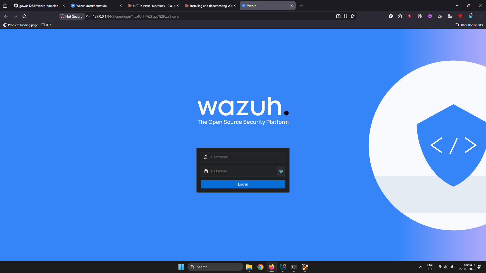
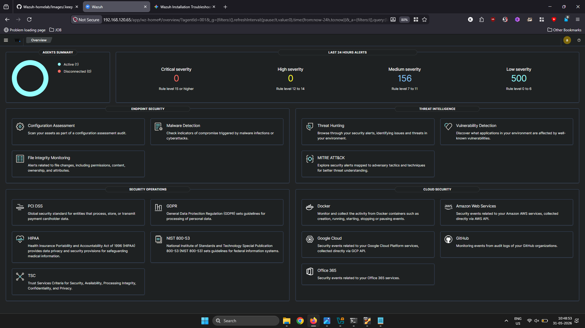

---

### 2. Linux Endpoint Enrollment (Linux001)

The separate Ubuntu Server endpoint agent was configured to securely register and bind its telemetry stream to the manager's listening socket:

```bash
# Download and install the official Wazuh repository GPG key
wget -qO - https://packages.wazuh.com/key/GPG-KEY-WAZUH | gpg --dearmor -o /usr/share/keyrings/wazuh.gpg

# Add the repository list entry
echo "deb [signed-by=/usr/share/keyrings/wazuh.gpg] https://packages.wazuh.com/4.x/apt/ stable main" | sudo tee /etc/apt/sources.list.d/wazuh.list

# Update package lists and install the agent pointed to the Manager IP
sudo apt-get update && WAZUH_MANAGER='192.168.172.65' sudo apt-get install wazuh-agent

# Enable and start the background daemon service
sudo systemctl daemon-reload
sudo systemctl enable wazuh-agent
sudo systemctl start wazuh-agent
```

#### 📊 Agent Deployment Verification

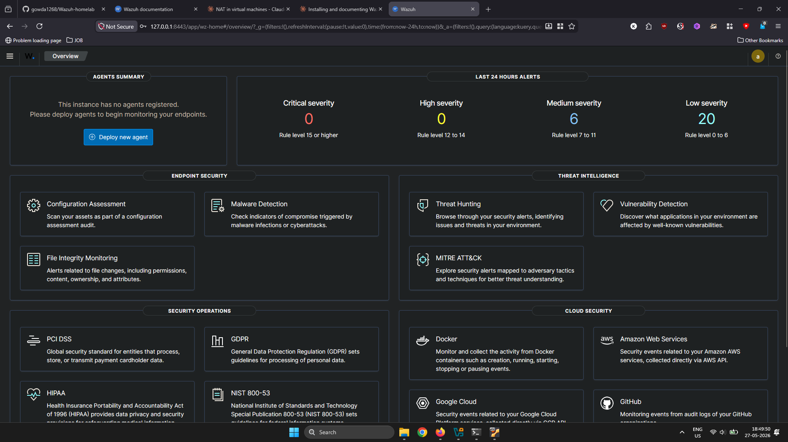
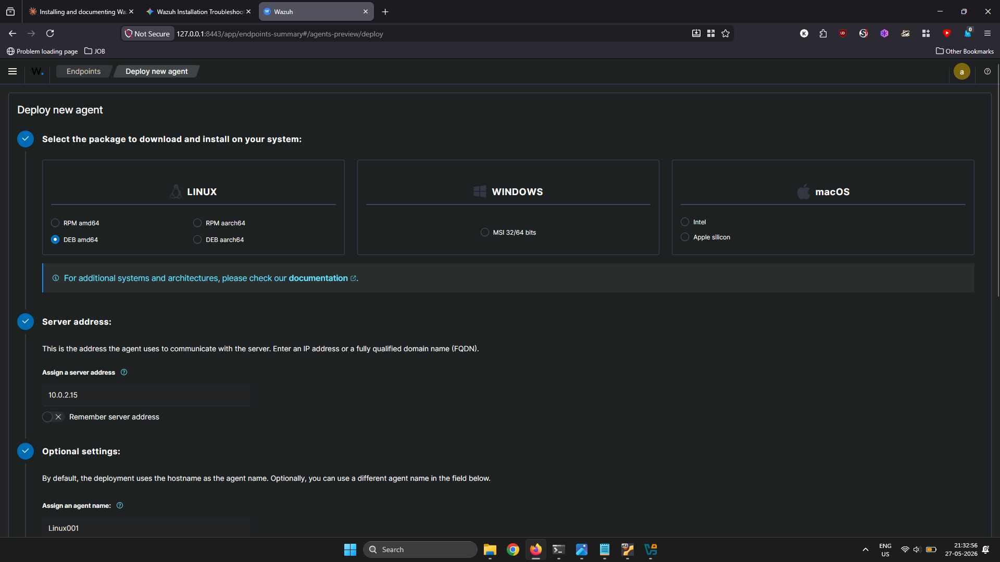
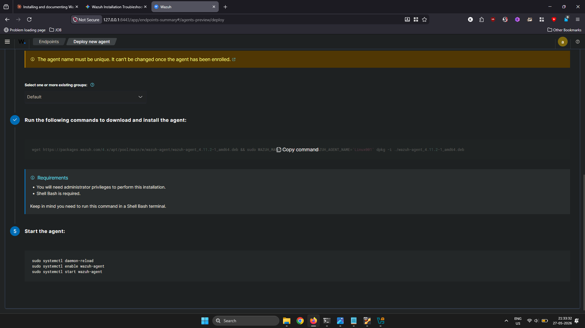

---

## 🛑 Phase 2: Infrastructure Engineering & Storage Resolution

### 1. Diagnosing Storage Watermark Freezes (OSError: [Errno 28])

During infrastructure initialization, the `wazuh-manager.service` failed to start. Forcing the background process into the foreground (`sudo /var/ossec/bin/wazuh-apid -f`) revealed a fatal exception: `OSError: [Errno 28] No space left on device`.

Running `df -h` confirmed that the root logical volume was pinned at 100% capacity. This storage ceiling hit the Wazuh Indexer's (OpenSearch) protective Flood-Stage Disk Watermark (95%), locking down all database write operations and triggering infinite boot loops.

### 2. Live LVM Volume Expansion

To resolve this issue gracefully without data loss or service degradation, Linux Logical Volume Manager (LVM) utilities were leveraged to dynamically allocate virtual hardware storage on-the-fly without requiring a system restart:

```bash
# Evaluate available physical group boundaries to confirm unallocated sector space
sudo vgs

# Extend the underlying logical file allocation to absorb 100% of newly exposed space
sudo lvextend -l +100%FREE -r /dev/mapper/ubuntu--vg-ubuntu--lv
```

---

## ⚡ Phase 3: Detection Engineering & Security Scenarios

### 🐧 Linux Endpoint Monitoring

---

### Scenario 1: Automated SSH Brute-Force & Active Response Containment

An aggressive SSH brute-force simulation loop was launched from the Windows Host machine terminal targeting the Ubuntu Linux Agent node:

```powershell
# Executed from Windows Host PowerShell (192.168.172.146)
for ($i=1; $i -le 10; $i++) { ssh fakeuser@192.168.172.11 }
```

#### 🛠️ Active Response Rule Optimization

To prevent service crashes, `/var/ossec/etc/ossec.conf` on the Wazuh Manager was optimized to handle local containment blocks dynamically:

```xml
<active-response>
  <command>firewall-drop</command>
  <location>local</location>
  <level>5</level>
</active-response>
```

The pipeline successfully identified the high-frequency failure pattern originating from the Windows host and automatically dropped the attacking connections. Running `iptables -L INPUT -v -n` on the agent verified live firewall bans dropping traffic from `192.168.172.146`.

#### 📊 Attack & Containment Artifacts


---

### Scenario 2: Host Privilege Escalation (Sudo Abuse)

To validate internal insider-threat tracking capabilities, an intentional privilege escalation attempt was simulated directly on the agent terminal by purposefully forcing high-severity administrative authorization failures via the sudo boundary:

```bash
sudo -k && sudo ls /root
# (Deliberately inputted incorrect credentials 3 consecutive times)
```

#### 📊 Administrative Log Audit


---

### Scenario 3: Local Account Tampering (File Integrity Monitoring)

To verify real-time monitoring of critical files, real-time tracking attributes were appended to the `<syscheck>` section inside the agent's `ossec.conf`:

```xml
<directories realtime="yes" report_changes="yes">/etc</directories>
```

An adversary simulation was executed on the agent by forcing an unauthorized local account creation:

```bash
sudo useradd hacker_test
```

#### 📊 FIM Real-Time Alert Analytics


---

### Scenario 4: Continuous Vulnerability Assessment & System Hardening

To identify software weaknesses, the Vulnerability Detector was activated within the manager's global configuration file:

```xml
<vulnerability-detection>
  <enabled>yes</enabled>
  <index-status>yes</index-status>
  <feed-update-interval>60m</feed-update-interval>
</vulnerability-detection>
```

#### 🔍 Attack Surface & Risk Evaluation

- **Vulnerability Assessment:** The Wazuh Vulnerability Detection module dynamically cross-references the software package inventory of the Ubuntu Agent against up-to-date vulnerability feeds to discover unpatched packages and system weaknesses.
- **Security Configuration Assessment (SCA):** Continuous CIS benchmarks were executed locally on the agent node to identify misconfigurations, weak permissions, and compliance drifts.

#### 🛠️ Remediation Engineering & Hardening Execution

```bash
# Edit the SSH configuration file to disable root login
sudo sed -i 's/^#PermitRootLogin.*/PermitRootLogin no/' /etc/ssh/sshd_config

# Restart the SSH service to enforce the new security baseline
sudo systemctl restart ssh

# Cycle the Wazuh Agent to push an immediate state re-inventory
sudo systemctl restart wazuh-agent
```

#### 📊 Vulnerability Posture & Compliance Card


---

## 🧹 Phase 4: Database Maintenance & Baseline Cleanliness

To maintain resource-conscious lab operations and safely flush heavy simulation streams before establishing pristine baseline tracking vectors, index administrative cleanups were invoked directly via the index API:

```bash
curl -k -u "admin":"<password>" -X DELETE "https://localhost:9200/wazuh-alerts-*"
```

<br>
<br>
<br>


---

## 🪟 Phase 5: Windows Endpoint Monitoring & Compliance Hardening (Agent 002)

### 3. Windows Agent (002) Deployment & Initialization

To enroll the Windows 11 Enterprise host into the centralized SIEM cluster, an automated provisioning approach was utilized via an elevated terminal session.

#### Automated Deployment Script

```powershell
Invoke-WebRequest -Uri https://packages.wazuh.com/4.x/windows/wazuh-agent-4.x.msi -OutFile ${env:TEMP}\wazuh-agent.msi; Start-Process -FilePath msiexec.exe -ArgumentList "/i ${env:TEMP}\wazuh-agent.msi /q WAZUH_MANAGER='192.168.120.65' WAZUH_AGENT_NAME='WindowsAgent' WAZUH_REGISTRATION_SERVER='192.168.120.65'" -Wait
```

#### Service Authorization

```powershell
# Start the background monitoring daemon
Start-Service -Name wazuh

# Verify the service state is running cleanly
Get-Service -Name wazuh
```

#### 📊 Windows Installation & Enrollment Handshake

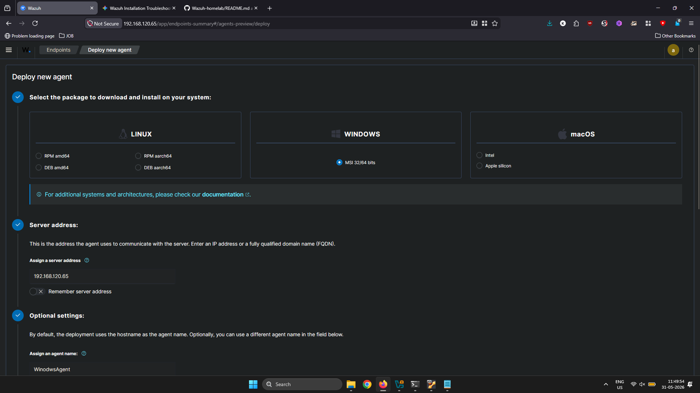
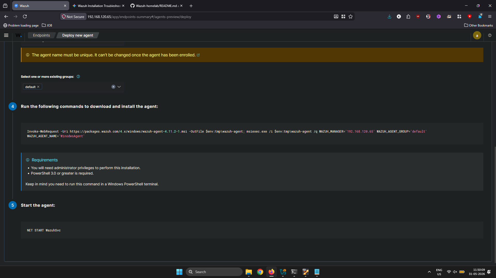

---

### 🪟 Scenario 1: Automated Windows RDP Brute-Force & Account Lockout

**Threat Vector:** Brute-forcing the Remote Desktop Protocol (RDP) via exposed port 3389 is one of the most common external entry points for attackers targeting Windows environments.

**Attack Simulation:**

```bash
# Execute from your Linux Agent terminal
hydra -l Administrator -P /usr/share/wordlists/fasttrack.txt rdp://<WINDOWS_AGENT_IP> -V
```

**What Wazuh Detects:** Wazuh monitors Windows Security Event ID 4625 (An account failed to log on) and aggregates rapid failures into a high-severity alert.

**Hardening Remediation:** Open Local Security Policy (`secpol.msc`) → Account Policies → Account Lockout Policy → set Account lockout threshold to **5 invalid logon attempts**.

#### 📊 RDP Brute-Force Artifacts

.png)


---

### 🪟 Scenario 2: Privilege Escalation via Windows Command Abuse (Whoami / Priv)

**Threat Vector:** Post-initial-foothold adversaries execute enumeration commands to identify privilege levels and plan escalation to SYSTEM.

**Attack Simulation:**

```cmd
whoami /priv
whoami /groups
net localgroup administrators
reg query HKLM\SOFTWARE\Microsoft\Windows\CurrentVersion\Run
```

**What Wazuh Detects:** Wazuh tracks Windows Event ID 4688 (A new process has been created), flagging suspicious command-line arguments and mapping to MITRE ATT&CK T1033.

**Hardening Remediation:** Enable "Include command line in process creation events" via `gpedit.msc` → Computer Configuration → Administrative Templates → System → Audit Process Creation.

#### 📊 Command Abuse Log Artifacts

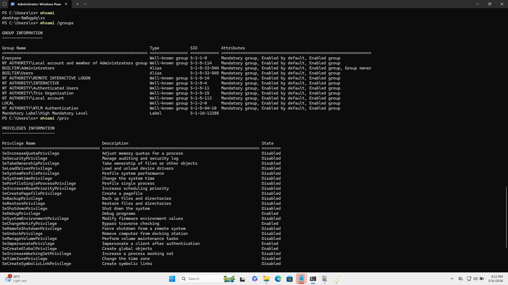
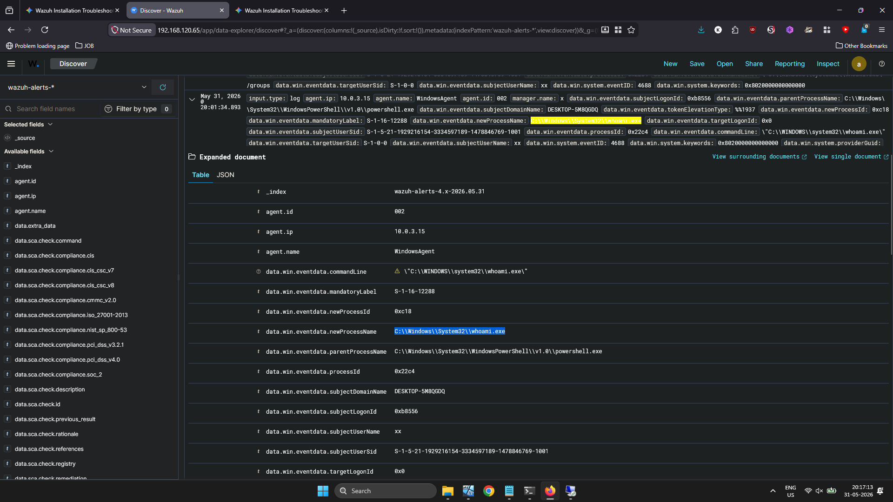
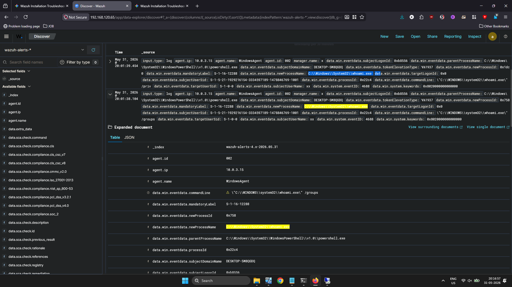
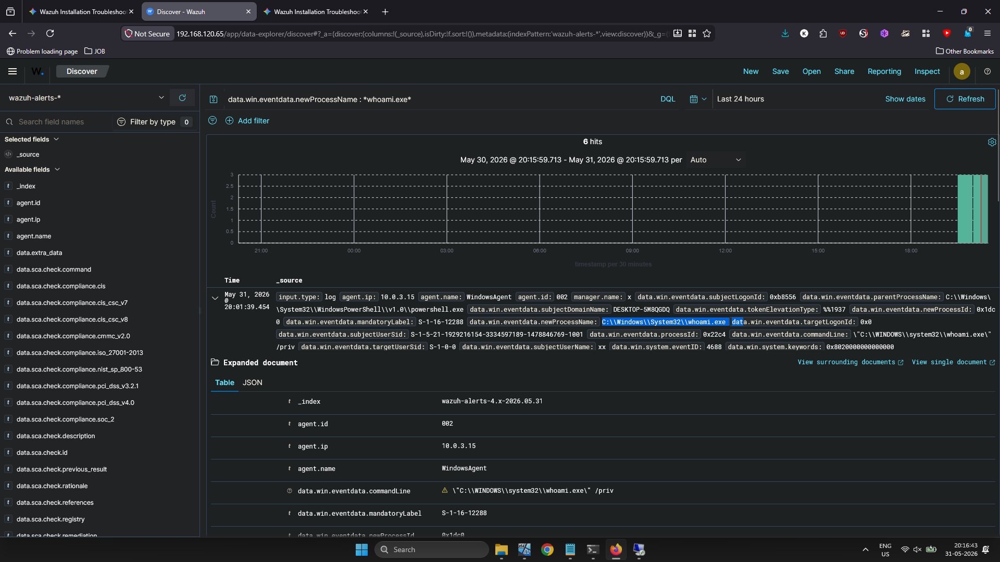


---

### 🪟 Scenario 3: Real-Time Windows Registry Tampering (FIM)

**Threat Vector:** Attackers modify Windows Registry Run keys to establish persistent access that survives reboots.

**Attack Simulation:**

```cmd
reg add "HKLM\Software\Microsoft\Windows\CurrentVersion\Run" /v MaliciousPersistence /t REG_SZ /d "C:\Windows\System32\cmd.exe" /f
```

**What Wazuh Detects:** Windows FIM (Syscheck) monitors registry keys out-of-the-box and raises a high-severity alert capturing the exact value string.

**Hardening Remediation:**

```cmd
reg delete "HKLM\Software\Microsoft\Windows\CurrentVersion\Run" /v MaliciousPersistence /f
```

Then configure `ossec.conf` on the Windows agent to monitor registry keys in `realtime="yes"` mode.

#### 📊 Registry Tampering Artifacts


---

### 🪟 Scenario 4: Windows Vulnerability Tracking & System Hardening (SCA)

**Objective:** Periodically audit endpoints against industry-standard configuration baselines to maintain strong system hardening practices.

**Initial Assessment Baseline:** The host machine initially achieved a compliance score of **24%**, flagging multiple configuration vulnerabilities defined by the CIS Microsoft Windows 11 Enterprise Benchmark v3.0.0.

**Identified Vulnerability Gap:** Rule ID 26003 — Ensure 'Minimum password length' is set to '14 or more character(s)' → Status: **Failed**.

**Remediation Action Executed:**

```cmd
net accounts /minpwlen:14
```

**SIEM Verification Outcome:** After forcing an on-demand re-scan, the Wazuh SCA sub-module updated the database record, shifting the rule state to **Passed** and reducing the local credential brute-forcing attack surface.

#### 📊 SCA Compliance Artifacts


